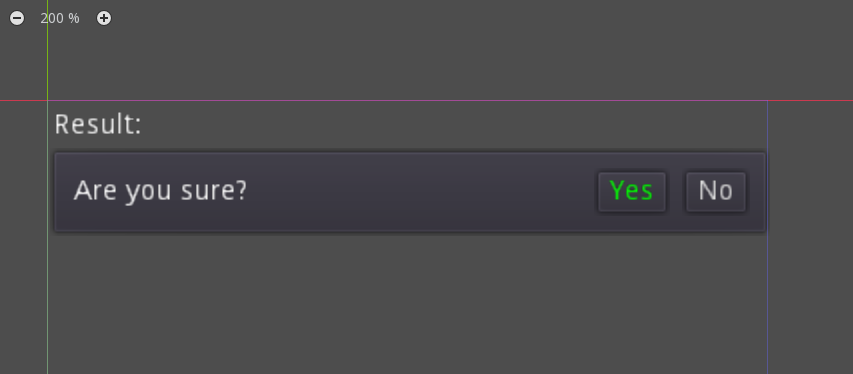
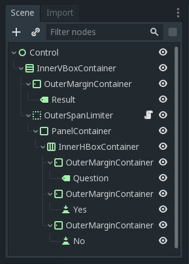
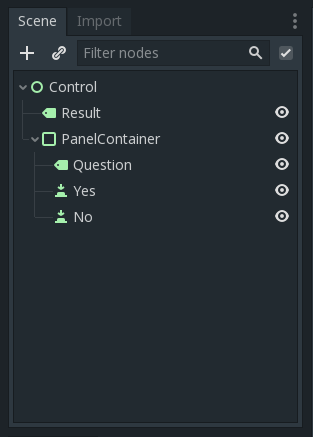

# UISimplifier
## Example

Addon disabled | Addon enabled
------------ | -------------
 | 

Containers with the prefix "Outer" and only one child will be merged with the children, and with "Inner" - with the parents.